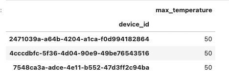
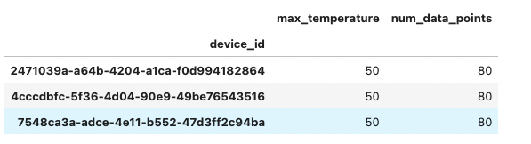
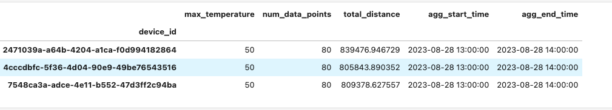
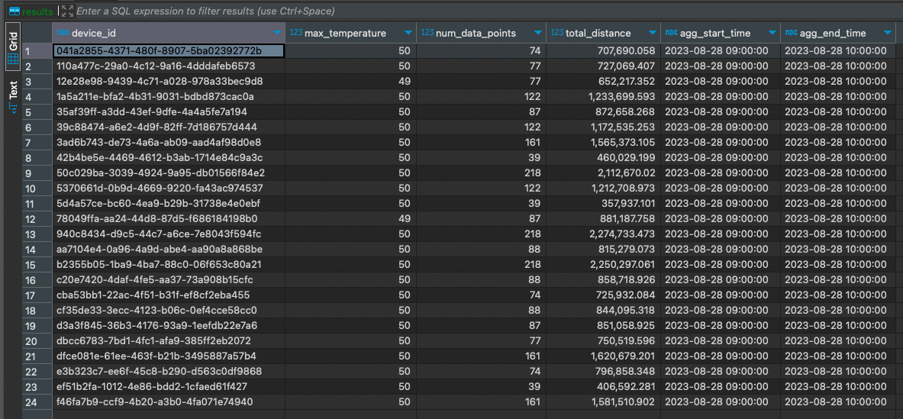

# Pair Finance

Data ETL.

## Table of Contents

- [Introduction](#introduction)
- [Features](#features)
- [Installation](#installation)
- [Usage](#usage)
- [Data Processing](#data-processing)
- [Results](#results)

## Introduction

In this project, we have access to a data simulator that generates data at a rate of 3 records per second. This data is stored in a PostgreSQL database table named "devices." The table's structure consists of several properties including the unique device ID, measured temperature, device location (in latitude and longitude), and a Unix timestamp.

Our task involves building an ETL (Extract, Transform, Load) pipeline to efficiently extract data from the PostgreSQL database. transform it by performing specific aggregations, and then store the aggregated data in a separate MySQL database. 


## Features
The pipeline will perform the following key steps:

Data Extraction: The ETL pipeline will retrieve data from the "devices" table in the PostgreSQL database.

Data Transformation and Aggregation:

Calculate the maximum temperatures measured for each device within each hour.
Calculate the total number of data points aggregated for each device within each hour.
Compute the total distance covered by each device's movement within each hour using the provided formula that accounts for latitude and longitude.


Data Loading: The transformed and aggregated data will be stored in the MySQL database.

The entire ETL process will be encapsulated within a Docker container and orchestrated using docker-compose commands. 
By following this process, we can efficiently manage and process the simulated data, gaining insights into device behavior and temperature patterns over time.

## Installation


```bash
# Example installation steps
git clone https://github.com/vkengine/pair-finance.git
cd pair-finance
docker compose up --build
```


## Usage

Usage of the Flow:

1. **Setup Environment**:
   - Ensure you have Docker installed on your system.
   - Clone the project repository to your local machine.

2. **Prepare Docker Compose**:
   - Navigate to the project directory.
   - Open the `docker-compose.yml` file.
   - Ensure that the PostgreSQL and MySQL configurations are correctly defined.

3. **Data Simulator**:
   - Start the data simulator using the provided script.
   - This simulator generates data and inserts it into the PostgreSQL "devices" table at a rate of 3 records per second.

4. **ETL Pipeline**:
   - Within the Docker container, the ETL pipeline runs automatically and performs the following tasks:
     - Extracts data from the PostgreSQL "devices" table.
     - Performs necessary data transformations and aggregations, including calculating maximum temperatures, data point counts, and total distances.
     - Stores the aggregated data into the MySQL database.

5. **Monitor Progress**:
   - Watch the Docker logs to monitor the progress of the ETL pipeline.
   - Observe the extraction, transformation, and loading steps in real-time.

6. **Access Aggregated Data**:
   - After the ETL process is complete, you can access the MySQL database to retrieve the aggregated data.
   - Query the MySQL tables to retrieve maximum temperatures, data point counts, and total distances for each device within each hour.

7. **Analyze Insights**:
   - Utilize the aggregated data to gain insights into device behavior and temperature patterns.
   - Perform further analysis on the aggregated results, such as identifying temperature trends and movement patterns.

8. **Modify and Extend**:
   - Adjust the ETL pipeline code to accommodate additional data transformations or calculations.
   - Explore different ways to visualize and interpret the aggregated data for enhanced insights.


## Data Processing 

Data Processing Documentation:

This section outlines the data processing steps involved in the ETL (Extract, Transform, Load) pipeline for the given task. The pipeline aims to extract data from a PostgreSQL database, perform various data transformations and calculations, and then load the processed data into a MySQL database. The main focus is on aggregating and calculating insights from the simulated device data.

#### Data Extraction:

The ETL pipeline starts by extracting data from the PostgreSQL database. The data is stored in the "devices" table and consists of the following properties:

- `device_id`: A unique identifier for the device sending the data.
- `temperature`: The temperature measured by the device.
- `location`: A JSON object containing latitude and longitude of the device's position.
- `time`: The time of the signal represented as a Unix timestamp.

#### Data Transformation and Aggregation:

1. **Maximum Temperatures Per Hour**:
   - The ETL pipeline calculates the maximum temperature recorded by each device within each hour.
   - This involves grouping the data by device and hour, and then finding the maximum temperature value in each group.

2. **Data Point Counts Per Hour**:
   - For each device, the pipeline calculates the total number of data points aggregated within each hour.
   - Grouping the data by device and hour, the number of records in each group is determined.

3. **Total Distance Covered Per Hour**:
   - To calculate the distance covered by each device within each hour, we utilize the provided formula:
     ```
     distance = acos(sin(lat1) * sin(lat2) + cos(lat1) * cos(lat2) * cos(lon2 - lon1)) * 6371
     ```
   - This formula considers the Earth's radius in kilometers and calculates the distance between two latitude-longitude points.
   - The pipeline groups data by device and hour, calculates distances for each pair of consecutive location points, and sums them up.

#### Data Loading:

The processed and aggregated data is loaded into a MySQL database. It involves creating or utilizing tables in the MySQL database that match the structure of the calculated insights (e.g., maximum temperatures, data point counts, total distances). The transformed data is then inserted into these tables.

#### Dockerized Execution:

The entire data processing workflow is encapsulated within a Docker container. This ensures a consistent and isolated environment for executing the ETL pipeline. The process is orchestrated using `docker-compose` commands.

#### Usage and Insights:

After the ETL process is complete, the MySQL database contains valuable insights about device behavior:
- Maximum temperatures measured by devices per hour.
- Number of data points aggregated by devices per hour.
- Total distance covered by devices per hour.

These insights can be further analyzed, visualized, and interpreted to uncover temperature trends, data point patterns, and movement behaviors.

## Results

#### Data Transformation and Aggregation

1. **Maximum Temperatures Per Hour**:
   - Calculate the maximum temperature recorded by each device within each hour.
   - Example visualization:
   
   
   
2. **Data Point Counts Per Hour**:
   - Calculate the total number of data points aggregated within each hour.
   - Example visualization:
   
   
   
3. **Total Distance Covered Per Hour**:
   - Calculate the distance covered by each device within each hour.
   - Example visualization:
   
   

4. **Final Table on Mysql**:
   - All combined data and datehour of their aggregations
   - - Example visualization:
   
   